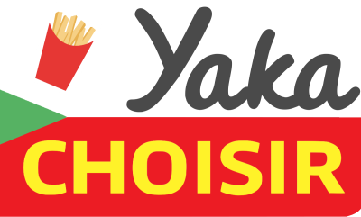

# Utilisez les données publiques de l'Open Food Facts

Lien GitHub vers le projet : [OC_Projet5_API_MP](https://github.com/MickaPch/OC_Projet5_API_MP)

OpenClassrooms - Projet n°5 - Parcours *Développeur d'applications - Python*  
Auteur : [MickaP](https://github.com/MickaPch/)  

> La startup *Pur Beurre* a remarqué que leurs utilisateurs voulaient bien changer leur alimentation mais ne savaient pas bien par quoi commencer.  
Par quoi remplacer nos aliments habituels ?  
Où se procurer des aliments alternatifs plus sains ?

> Leur idée est donc de créer un programme qui intéragit avec la base publique Open Food Facts pour en récupérer les aliments, les comparer et proposer à l'utilisateur un substitut plus sain à l'aliment qui lui fait envie.

## Sommaire
* [Pré-requis](#pre_requis)
* [Cahier des charges](#cahier_des_charges)
    * [Fonctionnalités du programme](#fonctionnalites)
        * [Lien vers les user stories & fonctionnalités](./resources/user_stories.md)
    * [Description du parcours utilisateur](#parcours_utilisateur)
* [Documents annexes](#annexes)

## Application console : ***Yaka CHOISIR***

## Pré-requis
* Utilisation du programme en terminal
* Environnement virtuel et installation des packages :
    * venv <!-- lien vers requirements.txt -->
    * pymysql
* Base de données MySQL
    * Création de la base de données MySQL **yaka_choisir**

## Cahier des charges

### Fonctionnalités du programme

[Lien vers les user stories & fonctionnalités](./resources/user_stories.md)
* Recherche d'aliments dans la base Open Food Facts.
* L'utilisateur interagit avec le programme dans le terminal.
* Si l'utilisateur entre un caractère qui n'est pas un chiffre, le programme lui répète la question.
* La recherche s'effectue sur une base MySQL.
* Enregistrement des informations dans une base de données par choix de l'utilisateur.

### Description du parcours utilisateur
* L'utilisateur est sur le terminal et lance l'application *path_to_directory*/yaka_choisir.py

* Le programme démarre et affiche la page de bienvenue.
L'utilisateur appuie sur la touche *Entrée*.

* Le programme affiche une page de connexion avec les choix suivants:
    1. S'inscrire
    2. Se connecter
    3. Utiliser l'application en tant que visiteur

* Suivant le choix de l'utilisateur :
    1. Le programme affiche un formulaire d'inscription avec vérification et validation des champs entrés par l'utilisateur
    2. Le programme affiche un formulaire de connexion avec identifiant d'utilisateur et mot de passe
    3. Le programme passe à l'étape de sélection des produits

* Si l'utilisateur est authentifié, le programme lui affiche les choix suivants :
    1. Quel aliment souhaitez-vous remplacer ?
    2. Retrouver mes aliments substitués.

* Sélection des produits, le programme pose les questions suivantes à l'utilisateur et ce dernier sélectionne les réponses :
    1. Sélectionnez la catégorie.
        * *Plusieurs propositions associées à un chiffre.*
        * *L'utilisateur entre le chiffre correspondant et appuie sur Entrée.*
    2. Sélectionnez l'aliment.
        * *Plusieurs propositions associées à un chiffre.*
        * *L'utilisateur entre le chiffre correspondant et appuie sur Entrée.*
    3. Le programme affiche les informations principales de l'aliment sélectionné. Le programme lui propose les choix suivants :
        * *Plus d'informations sur ce produit*
        * *Afficher les produits alternatifs*
        * *Enregistrer la recherche* **(l'utilisateur doit être inscrit et authentifié)**
    4. Après l'affichage de la liste des produits alternatifs, l'utilisateur peut choisir de comparer l'un des produits de la liste avec l'aliment auparavant sélectionné.

## Documents annexes

* [Lien vers les user stories & fonctionnalités](./resources/user_stories.md)
* Modèle physique de données
* Tableau Trello
* Démarche

<!-- Description des documents et leurs contenus -->